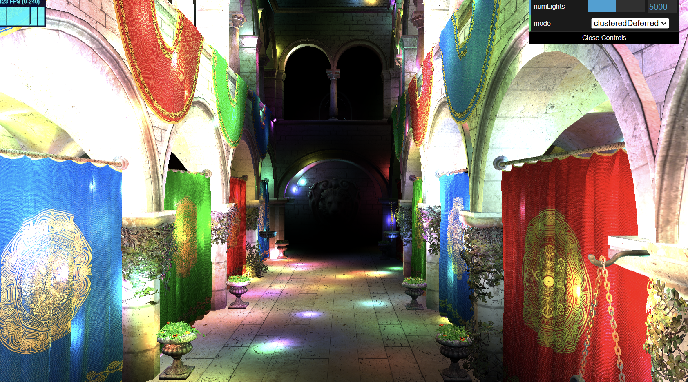

WebGL Forward+ and Clustered Deferred Shading
======================

**University of Pennsylvania, CIS 565: GPU Programming and Architecture, Project 4**

* (TODO) YOUR NAME HERE
* Tested on: (TODO) **Google Chrome 222.2** on
  Windows 22, i7-2222 @ 2.22GHz 22GB, GTX 222 222MB (Moore 2222 Lab)

### Live Demo

### Demo Video/GIF

https://github.com/user-attachments/assets/469c22a6-4303-4061-a8cc-edf6c265e64e

### (TODO: Your README)

hi gamers

## 

### Credits

- [Vite](https://vitejs.dev/)
- [loaders.gl](https://loaders.gl/)
- [dat.GUI](https://github.com/dataarts/dat.gui)
- [stats.js](https://github.com/mrdoob/stats.js)
- [wgpu-matrix](https://github.com/greggman/wgpu-matrix)
