WebGL Forward+ and Clustered Deferred Shading
======================

**University of Pennsylvania, CIS 565: GPU Programming and Architecture, Project 4**

* (TODO) YOUR NAME HERE
* Tested on: (TODO) **Google Chrome 222.2** on
  Windows 22, i7-2222 @ 2.22GHz 22GB, GTX 222 222MB (Moore 2222 Lab)

### Live Demo

[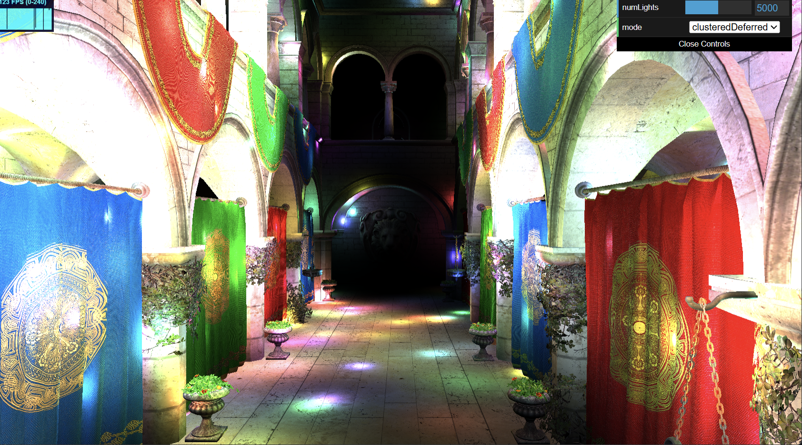](https://geant04.github.io/Project4-WebGPU-Forward-Plus-and-Clustered-Deferred/)


### Demo Video/GIF
https://github.com/user-attachments/assets/469c22a6-4303-4061-a8cc-edf6c265e64e

### In this project, I implement three different implementations of real-time lighting methods from a naive O(n) search to clustered forward plus lighting to deferred forward plus clustered lighting. 

Most games engines nowadays use a mix of forward plus and clustered forward plus - though many years ago, [DOOM 2016](https://advances.realtimerendering.com/s2016/Siggraph2016_idTech6.pdf) used a form of clustered lights with cleverly scalarized access. 

Presented in 2017, Michal Drobot introduces a more optimized version of clustered forward plus through Z-Binning to efficiently bin lights by depth in [Call of Duty : Infinite Warfare](https://advances.realtimerendering.com/s2017/2017_Sig_Improved_Culling_final.pdf), improving memory performance from clustered - ultimately, the ideas of forward-plus are still used today in modern real-time rendering to process and render tons of lights.

So to summarize, overall features implemented:
- Naive lighting solution
- Clustered Forward Plus Lighting
- Clustered Deferred Lighting

## Introduction to Clustered Forward Plus Lighting
To understand what clustered forward plus lighting is, we need to start from how we would typically render a scene without any optimizations and then gradually evolve to our implemented solution at the end.

The goal is to ultimately light our scene - given a pixel and the lights in the scene, we want to know how that pixel will be shaded based on the contributions of each light. If far enough, the pixel shouldn't be lit at all by attenuation, and similarly, pixels within the lighting radius of a point light should be colored brightly.


--- 
### Naive Lighting
In a typical forward rendering pipeline, information from a host-side vertex buffer gets passed to the GPU, where it gets processed by the vertex shader, then through primitive assembly and rasterization, becomes a fragment shaded by the fragment shader.

In the fragment shader, we can typically shade a fragment by looping through all the lights in our scene and then accumulating light contributions per light.

The base code handles contributions as such, before it's ultimately applied to the final color:
```
fn calculateLightContrib(light: Light, posWorld: vec3f, nor: vec3f) -> vec3f {
    let vecToLight = light.pos - posWorld;
    let distToLight = length(vecToLight);

    let lambert = max(dot(nor, normalize(vecToLight)), 0.f);
    return light.color * lambert * rangeAttenuation(distToLight);
}
```

And the result is a simple lit scene. However, it's easy to immediately see how this can struggle as we scale the lights, as it's an ```O(n)``` computation to evaluate every single light in the scene! 

Imagine how much computation is wasted from evaluating faraway lights or even occluded lights, and the performance is unfortunately unacceptable for rendering hundreds of lights in a scene.

---
### Forward Plus Tiled Rendering

As mentioned above, there are severe scaling issues from our naive lighting method that could greatly benefit from localizing light hotspots.

In 2012 from AMD, [Harada, et. al](https://takahiroharada.wordpress.com/wp-content/uploads/2015/04/forward_plus.pdf) introduced the concept of tiled rendering to bin lights into 2D screenspace tiles. Instead of shading a fragment by all the lights in the scene, the paper instead proposed to shade using lights only contained in the 2D tile encompassing the fragment. 

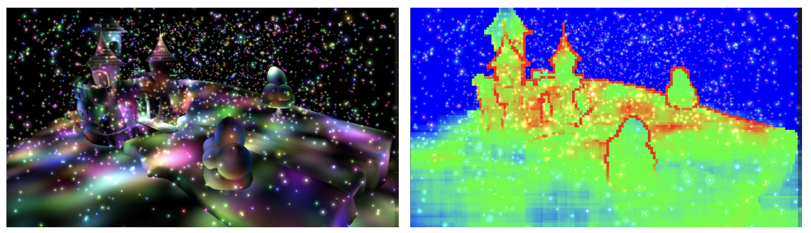
<br>
*Graphic from Harada, McKee, and Yang's paper. The left shows a sccene with 3,072 lights rendered in 1280x720 resolution, while the right shows a light heatmap representing the number of lights binned per tile. Red tiles have 50 lights, green have 25, and blue have 0.*


This way, **lighting contributions are localized,** and the amount of lights processed per fragment is limited by the most lights that can be stored in a tile. This significantly reduces the number of lights processed per fragment!

While the paper introduces the technique for deferred rendering pipelines, it's easily adaptable to forward rendering using compute shaders! We can implement our tile construction and light culling as such:

```
for each 2D cluster (# of clusters determined by 2D tile size and screen dimensions):
  Compute viewspace frustum AABB bounds
  Loop through all lights such that:
    if the light intersects with the frustum tile, add it to the bin 
```

To optimize depth, 2D forward plus pipelines also introduce light culling by min/max scene depth in a tile, such that lights not included within the range don't need to be binned.

<div align="center">
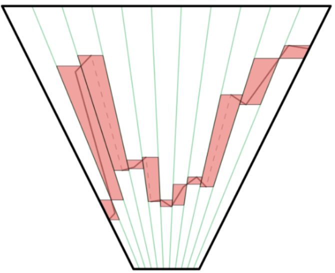
<br>
<i>Image from CIS 5650 slides, red boxes visualize min/max depth ranges per 2D tile</i>
</div>
<br>

---
### Clustered Forward Plus Rendering
While very promising, tiled 2D forward plus still introduces a possible limitation - considering an extremely large min/max Z range, this allows us to unfortunately bin a ton of lights that can reintroduce the problem of evaluating faraway lights from before.

Instead of having 2D tiles, we can instead have 3D clusters, such that each cluster has a Z-range to bin lights, solving the localization problem from before at the expense of using more memory to store an extra dimension of clusters. This is known as [Clustered Rendering](https://www.highperformancegraphics.org/previous/www_2012/media/Papers/HPG2012_Papers_Olsson.pdf), introduced by Ola Olsson at HPG 2012.

<div align="center">
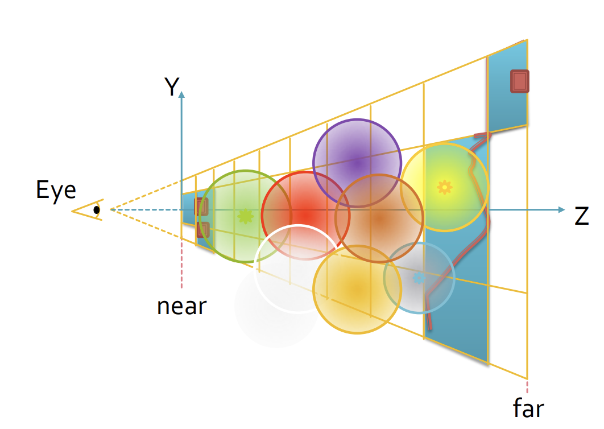
<br>
<i>Visualization of clusters from Olsson's presentation.</i>
<br>
<br>

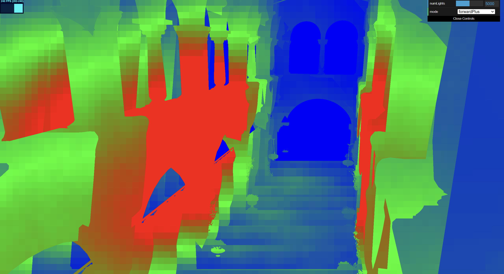
</div>
<br>

Here's a heat lightmap of my Sponza scene clusters in a scene with 5,000 lights. Each cluster has 32px by 32px tile size and stores a max of 500 lights. Using a [0,1] normalized value representing the number of lights in a cluster, the color is determined by interpolating between blue to green to red, where fully red tile colors store the max number of lights, green stores 250 lights, and blue stores 0.

---
### Clustered Deferred Rendering
To address overdraw and wasted light calculations on fragments not ultimately visible at the end, we can switch back from a forward pipeline to **deferred** to optimize performance.

Deferred rendering works differently from forward rendering by evaluating all shading calculations in one pass, where we only shade fragments visible to the camera. This is done by using forward rendering to draw our scene to G-Buffers, or textures storing scene information such as albedo (material color), depth, and normal information. 

<table>
<tr>
  <th>Albedo</th>
  <th>Normals</th>
</tr>
<tr>
  <td>
  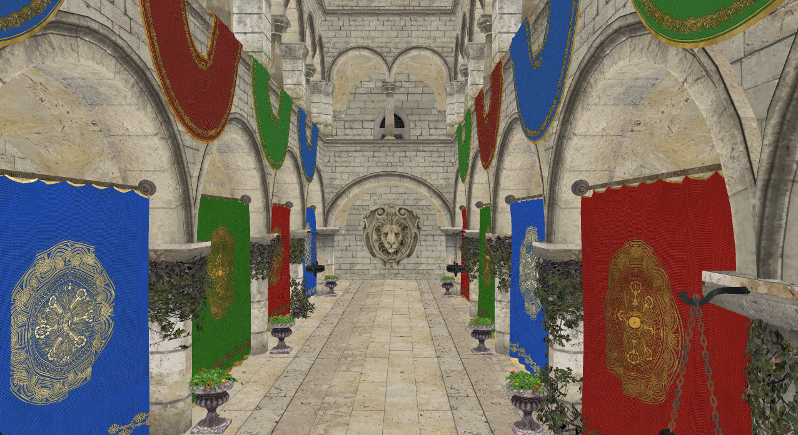
  </td>
  <td>
  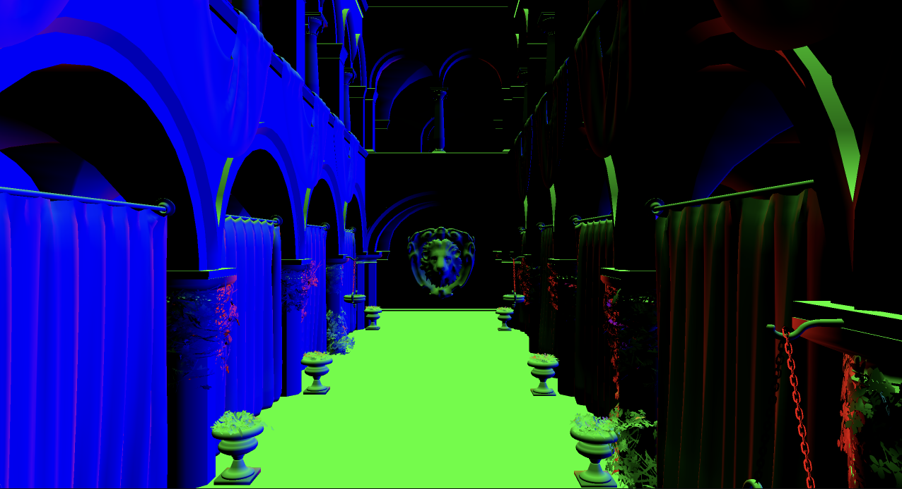
  </td>
</tr>

<tr>
  <th>Depth</th>
  <th>Final Composite</th>
</tr>
<tr>
  <td>
  
  </td>
  <td>
  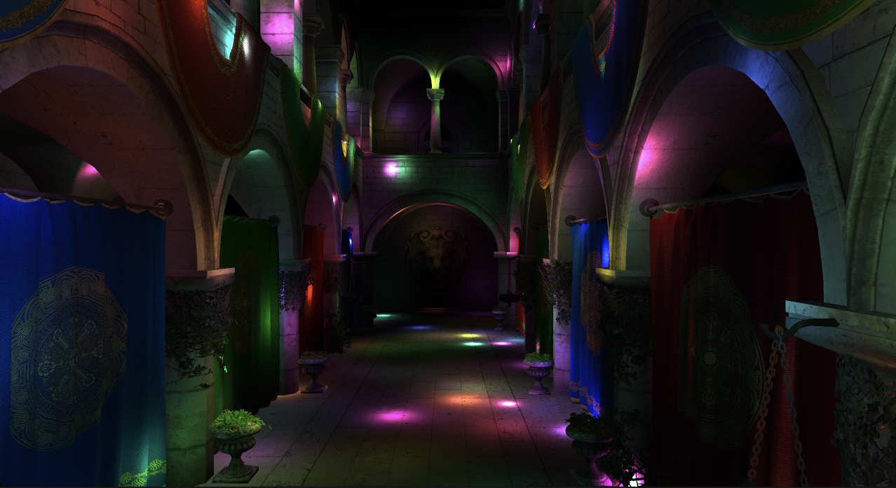
  </td>
</tr>

</table>

Using these G-Buffers allow us to construct our final scene by compositing the results of our G-Buffers and shading fragments by on-screen only normals, depth, etc.

For highly expensive geometric scenes, deferred rendering works wonderfully by reducing heavy wasted shading calculations from overdraw. However, this is at the cost of memory use - assuming our G-buFfers are full resolution with relatively expensive texture formats used per buffer, storing and reading all of our buffers on the GPU can be incredibly expensive during the shading and writing stage.

Most games nowadays don't use pure deferred rendering for these memory reasons, and instead opt for a depth-prepass to quickly cull scene info to prevent overdraw. Deferred rendering also makes transparency incredibly difficult and is often ignored in such pipelines.

## Performance Analysis
In theory, using these optimizations, it should stand that clustered deferred should work the best over clustered forward lighting, and with naive as the slowest. I analzyed performance among the three based on different lights, clusters, and work group sizes.

Ultimately, I found that clustered deferred worked the best consistently across all tests, and that forward plus posed an inherent advantage over naive.

I tested for performance by disabling the move light compute shaders and using a light radius of 1 to get enough naive readings from the FPS stats.

---
### Performance vs. Number of Lights
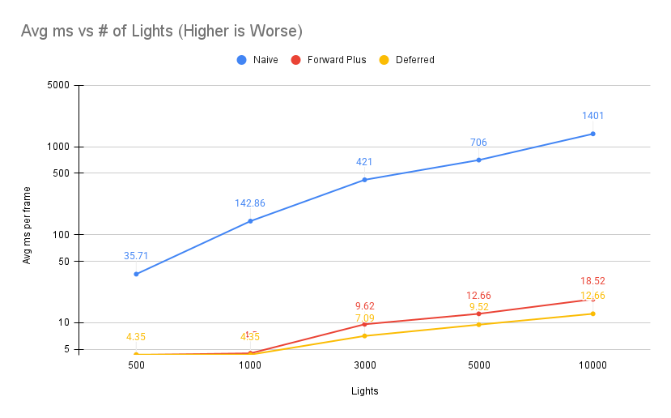

As noted previously, both the deferred and forward plus solutions scaled much better across larger numbers of lights. 

Ms for naive increases in a linear fashion, while both forward plus and deferred scale nearly logarithmically. This is mostly from the localized binning of the lights, allowing lesser lighting calculations per fragment based on the cluster. Deferred runs much faster than forward because of the single light shading for what's on screen, avoiding overdraw from Sponza's complex geometry.

I would expect that for simpler scenes, like a simeple plane, the overhead from sampling deferred's expensive texture formats would cause worse performance compared to forward plus, which has most fragments present on screen immediately with little overdraw.

---
### Performance vs. Number of Clusters (Based on Tile Size)
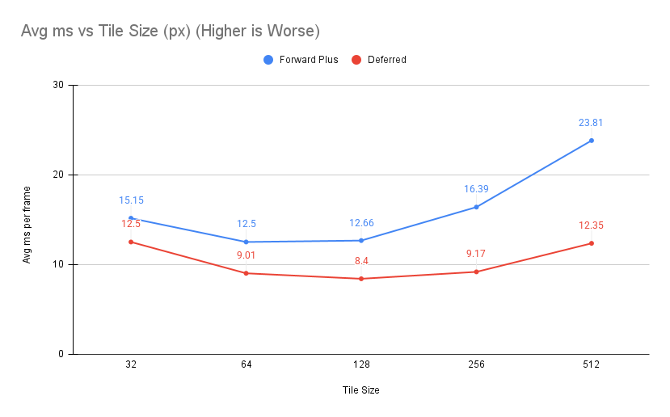

To test for performance based on the number of clusters, I was able to change the tile size to adjust clusters, where smaller tile sizes correspond to more clusters, and larger clusters correspond to less clusters. For this analysis, I kept the number of clusters in the Z axis constant at 32.

From testing, I found that performance is best around 64 and 128, which **I've calculated to about 28,160 to 7040 clusters, or # just under 10,000 being optimal**. 

Having less clusters, or bigger tile sizes, will cause respective frustum bounding boxes to grow in volume, meaning that it will store more lights, and therefore more lights are processed per fragment. However, by having more clusters, the boxes grow smaller, and it's less likely for more lights to be stored per cluster.

While it seems more ideal to have more clusters then to process less lights, this requires more memory since we're storing more clusters in memory (keep in mind that all max light sizes need to be determined by compile time). Figuring out this balance is not trivial, and ultimately a fine balance was found between memory bandwidth (from storing more clusters) and computation cost (from processing more lights).

---
### Performance vs. Varying Workgroup Sizes
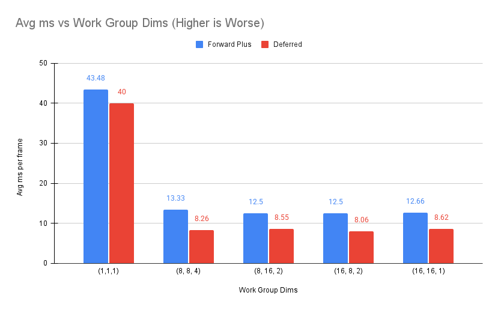
 

---
### Performance vs. Cluster Light Size
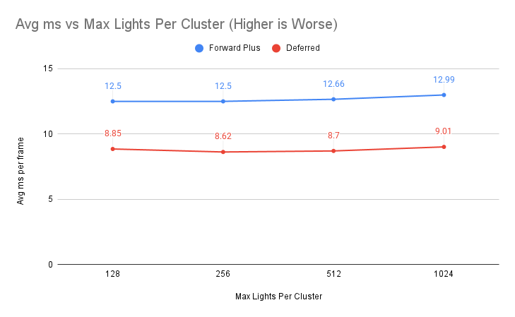

---
### Overall Conclusions


### Credits

- [Vite](https://vitejs.dev/)
- [loaders.gl](https://loaders.gl/)
- [dat.GUI](https://github.com/dataarts/dat.gui)
- [stats.js](https://github.com/mrdoob/stats.js)
- [wgpu-matrix](https://github.com/greggman/wgpu-matrix)
